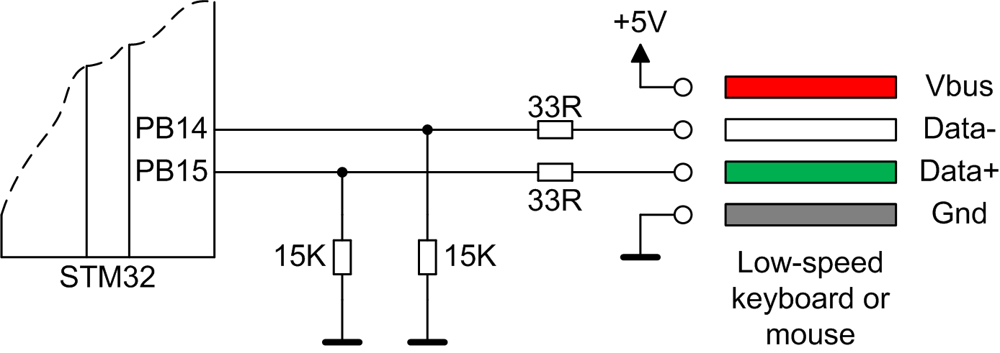

# SoftUSB
Soft low-speed USB host for ARM microcontrollers.

- Requires 70+ MHz ARM microcontroller with 2 timers and 2 pins.
- Main 1 KHz timer can do other work after library's work completed.
- CPU load 0.1 - 0.8%.
- Peak CPU delay will not exceed 130 microseconds.
- USB keyboard and mouse support.
- Character translation.
- Character and scancode buffers for "getch()" and "kbhit()".
- Provides mouse coordinates, buttons, and wheel.



## Usage
```cpp
// Define USB host on PORTB.14 (d-) and PORTB.15 (d+)
SoftUsb usb(PORTB, 14, 15);

// Timer 1 KHz routine
void timer1khz()
{
  usb.timer1ms();
  
  // Do other periodic work
}
```

Keyboard example:
```cpp
void keyboard_test()
{
  int code = 0;
  int type = 0;
  int prev_type = 0;

  printf("Waiting for a keyboard connection\n");
  for (;;)
  {
    Sleep(1);
    
    type = usb.get_device_type();
    // Check if status changed
    if (type == prev_type)
    {
      continue;
    }
    prev_type = type;
    
    if (type == USB_DEVICE_KEYBOARD)
    {
      // OK, keyboard connected
      break;
    }
    else if (type == USB_DEVICE_MOUSE)
    {
      printf("Mouse detected\n");
    }
    else if (type == USB_DEVICE_FULLSPEED)
    {
      printf("Fullspeed device detected - will not work\n");
    }
    else if (type == USB_DEVICE_UNKNOWN)
    {
      printf("Unknown device connected\n");
    }
  }
  
  printf("Keyboard connected: VID_%.4X&PID_%.4X\n", usb.get_vendor_id(), usb.get_device_id());
  
  for (;;)
  {
    if (usb.kbhit())
    {
      code = usb.getch();
      printf("Key pressed: %c (code %d)\n", code, code);
    }
    Sleep(1);
  }
}
```

Mouse example:
```cpp
void mouse_test()
{
  int type = 0;
  int prev_type = 0;

  printf("Waiting for a mouse connection\n");
  for (;;)
  {
    Sleep(1);
    
    type = usb.get_device_type();
    // Check if status changed
    if (type == prev_type)
    {
      continue;
    }
    prev_type = type;
    
    if (type == USB_DEVICE_KEYBOARD)
    {
      printf("Keyboard detected\n");
    }
    else if (type == USB_DEVICE_MOUSE)
    {
      // OK, mouse connected
      break;
    }
    else if (type == USB_DEVICE_FULLSPEED)
    {
      printf("Fullspeed device detected - will not work\n");
    }
    else if (type == USB_DEVICE_UNKNOWN)
    {
      printf("Unknown device connected\n");
    }
  }
  
  printf("Mouse connected: VID_%.4X&PID_%.4X\n", usb.get_vendor_id(), usb.get_device_id());
  
  for (;;)
  {
    int mx, my, mb, mw;
    
    usb.get_mouse_pos(mx, my, mb, mw);
    
    printf("Mouse report: X = %d, Y = %d, buttons = %d, wheel = %d\n",
      mx, my, mb, mw);
    
    Sleep(1);
  }
}
```

### Multiple ports example
```cpp
// Define 2 USB hosts
SoftUsb usb1(PORTA, 12, 13);
SoftUsb usb2(PORTB, 14, 15);

// Timer 1 KHz routine
void timer1khz()
{
  // Current port number
  static unsigned char port = 0;
  
  // Call service routines
  usb1.timer1ms(port == 0);
  usb2.timer1ms(port == 1);
  
  // Handle 2 ports
  port++;
  port %= 2;
  
  // Do other periodic work
}
```

## Porting
The library needs 2 timers:
- free-running up-counting 1.5 MHz with ability to immediately restart counting.
- periodic 1 KHz.

2 microcontroller's pins must be connected to USB "d+" and "d-".
Note that voltage level on this pins must be in range 0 - 3.3V.

You can use "platform_stm32f4.h" as a template for a new platform file.

## Disclaimer
The library is provided "as is". Use it on your own risk.
